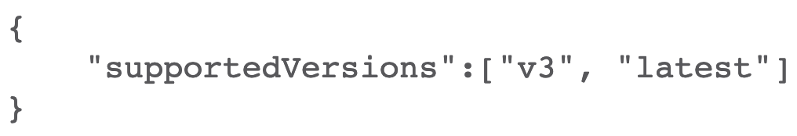

# API-versions-accepted

 

## Use Case Description

This script assists an API developer to determine which API versions are accepted with a specific Firepower Defense Manager console.
It can be run from any platform that has python3 installed.

## Installation

After installing python3 and pip3 on your operating system of choice, please run the following command in the directory containing the requirements.txt file so that necessary dependencies can be installed:
`pip3 install -r requirements.txt`

## Configuration

No configuration possible. This script is a simple GET request for the accepted API versions.

## Usage

apiGET.py is a python script that makes use of the requests module to ask the target server what APIVersions it accepts.
There is only one input (first command line argument) which is an IP address.
The accepted API versions are the output.
This script can be executed on any platform that has python3 installed and the requests plugin installed.

To run the script use one of the following methods:
`./apiGET.py <IP address of server>`
`python3 apiGET.py <IP address of server>`

## How to test the software

For testing, please review the "apiGETtest.py" script bundled in this repo.

## Getting help

If you have questions, concerns, bug reports, etc., please contact me.

## Author(s)

This project was written and is maintained by the following individuals:

* Sudhir H. Desai — suddesai@cisco.com
